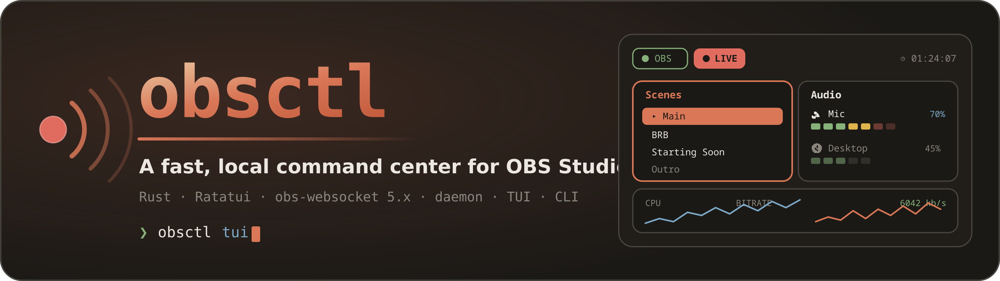
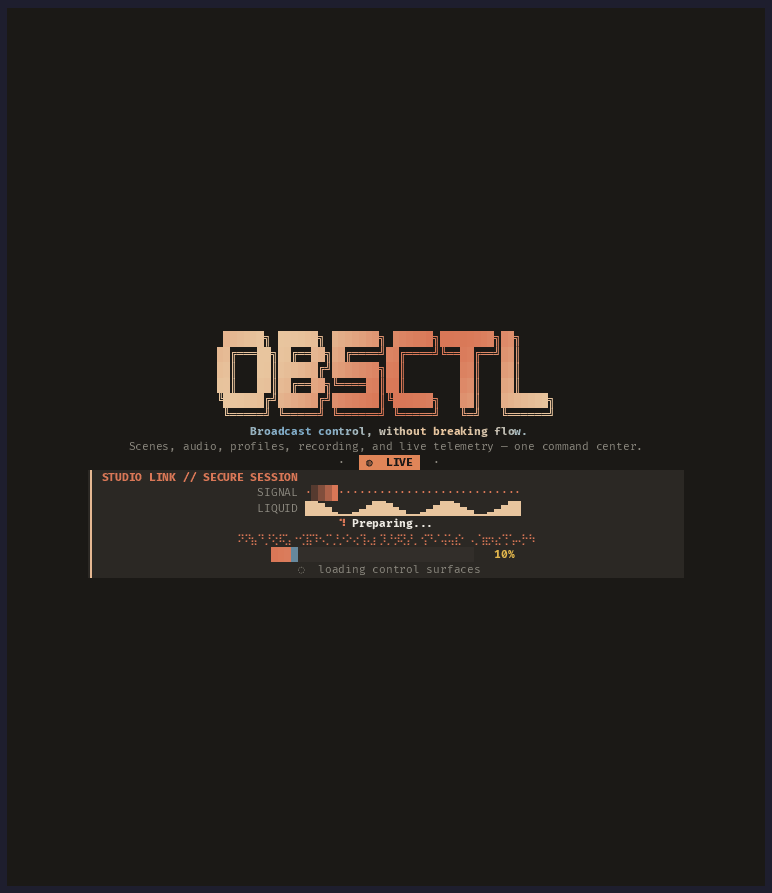

<div align="center">



<br>

[](https://github.com/worxbend/obsctl-rs/releases/latest)
[](LICENSE)
[](https://www.rust-lang.org)
[](#-install)
[](https://github.com/obsproject/obs-websocket)

**Drive OBS Studio from a keyboard-first terminal dashboard — or script it from the CLI.**
A single Rust binary: a daemon that owns the OBS connection, a live TUI, and a stable proxy CLI.

[**Website**](https://worxbend.github.io/obsctl-rs/) · [**obs.worxbend.com**](https://obs.worxbend.com/) · [Demo](#-watch-a-session) · [Install](#-install) · [Quick Start](#-quick-start) · [TUI](#-the-tui) · [Themes](#-themes) · [CLI](#-cli-commands) · [IPC Protocol](#-ipc-protocol)

</div>

---

## ✨ Highlights

|   |   |
|---|---|
| 🎛️ **Real-time TUI dashboard** | Scenes, audio matrix with dB meters, profiles, collections, live telemetry, and a streaming log feed — all in one keyboard-driven view. |
| ⚡ **Snappy, non-blocking input** | Volume, mute, and scene switches apply optimistically with debounced writes, so the UI never stalls on a round-trip. |
| 🧩 **Daemon-first architecture** | One process owns the OBS WebSocket. The TUI and CLI are thin IPC clients over a local Unix socket. |
| 🎨 **29 built-in themes** | btop-style live theme picker with whole-UI preview, plus fully custom palettes — down to a TTY-safe `mono` mode. |
| 🙈 **Scene profiles** | Name a set of scenes to hide — utility and nested scenes stop cluttering every list. Switch sets from the TUI (`<Space>P`), the palette, or the CLI. |
| 🤖 **Scriptable CLI** | Every action has a proxy command with a stable `--json` envelope and documented exit codes — perfect for hotkeys and automation. |
| 🔒 **Secret-safe by design** | Passwords come from env vars, never plaintext config; logs and error messages are run through a redaction boundary. |
| 🌍 **Localizable** | Ships English + Ukrainian, with drop-in runtime locale files — no recompile required. |
| 🦀 **Single static binary** | Pure Rust + Ratatui. `curl \| sh` install, or a `systemd --user` service. No runtime dependencies. |

---

## 🖥️ The TUI

<div align="center">

</div>

<div align="center"><sub>An unedited session — the same recording <a href="https://worxbend.github.io/obsctl-rs/#demo">plays as sharp, scrubbable text on the website</a>.</sub></div>

A real-time, themeable command center with animated gradient chrome, rounded/heavy focus borders, Unicode symbols, and responsive layouts. The advanced interface is enabled by default; set `ui.advanced_ui: false` for a simplified ASCII-safe TTY mode, or `ui.show_icons: false` to hide icons while keeping the other advanced elements.

- 🎬 **Scenes panel** (`s`) — navigate with `j`/`k` or arrows, `Enter` to switch; the newly active scene briefly flashes. Scenes marked hidden are left out of the list, and `<Space>P` opens the scene-profile editor: a modal that lists *every* scene (hidden ones dimmed), `t` hides or reveals the one under the cursor, `n` names the set, and `Enter` saves it to the config as a named **scene profile** you can switch between
- 🔊 **Audio matrix** (`a`) — OBS's Audio Mixer in the terminal: one bordered vertical channel strip per input, each with a fader, a green/yellow/red dB meter, and its own dB scale. `←`/`→` (or `h`/`l`) picks a strip, `↑`/`↓` (or `k`/`j`) nudges its volume ±5%, `m` mutes
- 🗂️ **Profiles panel** (`p`) — `Enter` to switch OBS profiles
- 📚 **Collections panel** (`c`) — `Enter` to switch OBS scene collections
- ⌨️ **Vim / AstroNvim keymap** — `j`/`k`, `gg`/`G`, `Ctrl-D`/`Ctrl-U`, count prefixes (`12j`), `Ctrl-hjkl` window moves, `Tab` to cycle panes, and a `<Space>` leader with a which-key popup
- 🖱️ **Mouse navigation** — click a row to focus and select it, click again to activate, wheel to scroll a panel or the log history, right-click to cancel
- 🚦 **Broadcast status pane** — pinned to the top-right corner, spelling the current state in oversized block letters: `IDLE` when nothing is running, `LIVE` and `REC` (side by side when both) with elapsed durations as they start. Each state animates its own distinct spinner, so the state is readable from the animation alone
- 📡 **Telemetry deck** — active scene, FPS, stream bitrate with a sparkline, and braille meters for CPU and memory that mark the session peak alongside the live value
- 🪵 **Logs panel** — severity glyphs, colored targets/timestamps, and semantic highlighting for actions, status/error keywords, commands, numbers, and live OBS scene/profile/collection/input names
- ⚡ **Stats panel** — appears beside the logs the moment you go live: active FPS against the rate you've been holding, average frame render time as a share of the frame budget, and render/output frames skipped. Every row is colored by health and topped with a plain-language verdict (`HEALTHY` / `STRAINED` / `DROPPING`). Drop counts are measured from the start of the current stream, not OBS's since-launch totals
- 🎛️ **Command palette** (`:`) — `:scene`, `:profile`, `:collection`, `:mute`, `:vol`, `:stream`, `:rec`, `:scene-profile`; `Tab` completes, `Ctrl-W`/`Ctrl-U` edit the line, and results stream in with a typewriter animation
- 🧭 **Header** — animated gradient identity, daemon/OBS connection chips, active scene/profile, and a render frame indicator
- 🌈 **Settings view** (`F2`, `Ctrl-T`, `<Space>ut`, or `:themes`) — btop-style theme picker with live full-UI preview; `Enter` persists, `Esc` reverts
- 🎇 A responsive animated splash (~2s, skippable by any keypress) with a large block logo, slither and liquid-wave loaders, a shimmering `Preparing...` braille band, a multi-color progress rail, and staged boot messages

### 📽️ Watch a session

The recording at the top of this section is the whole tour: the splash, the dashboard,
scene switching, the audio matrix, the `:` command palette, the `<Space>` which-key menu,
and live theme previews.

It is a GIF here only because GitHub cannot play a terminal recording inline. The source
is an [asciinema](https://asciinema.org) cast, which is the better way to watch it — the
text stays sharp at any size and you can pause and copy straight out of it. It **[plays in
the browser on the website](https://worxbend.github.io/obsctl-rs/#demo)**, or locally from
a clone:

```sh
asciinema play docs/demo/obsctl-rs.cast
```

Dashboard layout, top to bottom: header, status bar, a scenes/audio row (larger, since those lists tend to be longer), a profiles/collections row (smaller), logs, and the command palette. The broadcast status pane takes the top-right 32 columns across both chrome rows; below 76 columns of terminal width it steps aside and the status bar shows inline `IDLE`/`LIVE`/`REC` badges instead. While streaming, the stats panel takes the right-hand 46 columns of the logs strip — on terminals too narrow to fit both, logs keep the full width.

See [Themes](#-themes) for the full list of built-in themes and how to define a custom palette.

---

## 🧭 Architecture

```
OBS Studio <── obs-websocket 5.x ──> obsctl server <── Unix socket IPC ──> obsctl tui
                                                    <── Unix socket IPC ──> obsctl CLI
```

**Hard rule:** only `obsctl server` connects directly to OBS. The CLI and TUI are thin IPC clients.

---

## 📦 Install

Download and install the latest Linux release into `~/.local/bin`:

```sh
curl --proto '=https' --tlsv1.2 -sSf https://github.com/worxbend/obsctl-rs/releases/latest/download/install.sh | sh
```

Set `OBSCTL_VERSION` to pin a specific release tag, or `OBSCTL_INSTALL_DIR` to install elsewhere. The script also adds the install directory to `PATH` in `~/.bashrc` and `~/.zshrc` if it's missing.

---

## 🚀 Quick Start

```sh
cargo build --release

# Initialize config
./target/release/obsctl init

# Set your OBS WebSocket password
export OBS_WEBSOCKET_PASSWORD='your_password'

# Validate config
./target/release/obsctl validate-config

# Start the daemon
./target/release/obsctl server --headless

# Use CLI commands
./target/release/obsctl server-status
./target/release/obsctl obs-status
./target/release/obsctl dump-config
./target/release/obsctl scene 'Main'
./target/release/obsctl mute 'Mic'
./target/release/obsctl vol 'Mic' 70

# Launch the TUI dashboard
./target/release/obsctl tui
```

---

## 🔧 Service Install (systemd --user)

```sh
obsctl service install
systemctl --user enable --now obsctl.service
obsctl service status
```

---

## ⚙️ Config

Default path: `~/.config/obsctl/config.yml`

Override: `OBSCTL_CONFIG=/path/to/config.yml` or `--config PATH`

```yaml
version: 1
server:
  socket_path:           # optional; defaults to $XDG_RUNTIME_DIR/obsctl/obsctl.sock
  allow_remote_shutdown: false
connection:
  host: "127.0.0.1"
  port: 4455
  password_env: "OBS_WEBSOCKET_PASSWORD"
  connect_timeout_ms: 3000
  request_timeout_ms: 2500
reconnect:
  enabled: true
  endless: true
  initial_delay_ms: 500
  max_delay_ms: 10000
  multiplier: 1.8
  jitter_ms: 250
ui:
  refresh_interval_ms: 250
  command_palette_prefix: ":"   # ":" (vim-style) or "/" — both keys always work
  mouse: true                   # false restores the terminal's own text selection
  advanced_ui: true
  show_icons: true
  theme: "claude"       # built-in id, or "custom" — see Themes below
  # custom_theme:
  #   accent: "#D97757"
  # locale: "en"        # "en" or "uk" — see Localization below
scenes: []
  # - name: "Utility BG"    # as OBS spells it
  #   alias: "bg"
  #   hidden: true          # leave it out of every list obsctl shows
scene_profiles: []
  # - name: "streaming"
  #   hidden: ["Utility BG", "Overlay Src"]
  # - name: "everything"
  #   hidden: []
active_scene_profile:       # null, or the name of one of the above
audio:
  inputs: []
keymap:
  quit: ["q", "ctrl+c"]
  command_palette: ["/", ":"]
  reload_config: ["r"]
  dump_config: ["D"]
```

> 🔒 **Security:** never set `connection.password` in plain text. Use `password_env` to point to an environment variable name.

### Hiding scenes and scene profiles

OBS projects often carry scenes that exist only to be nested inside other scenes. They are noise in a
scene list, so obsctl can hide them. There are two layers, and the second wins whenever it is switched on.

**The baseline** is `scenes[].hidden`. Set it to `true` on a scene and obsctl leaves that scene out of
the TUI scene list and out of everywhere else obsctl lists scenes. The scene still exists in OBS and can
still be switched to by name; it is only hidden from obsctl's own lists.

**A scene profile** is a *named* set of those choices — `scene_profiles[]` above, each with a `name` and
a `hidden` list of scene names spelled as OBS spells them. `active_scene_profile` names the one in
effect, and matching is case-insensitive. The word "profile" is doing double duty here, so to be
explicit: an obsctl **scene profile** has nothing to do with an **OBS profile** (`obsctl profile`, the
`Profiles` panel). One is a set of scene-visibility choices that only obsctl knows about; the other is
OBS's own encoder and output configuration.

While a scene profile is active it **replaces** the per-scene flags rather than adding to them. Every
scene the active profile lists is hidden and every scene it does not list is visible, even one whose
`scenes[]` entry says `hidden: true`. That is what lets a profile *reveal* a scene, and what makes a
profile with an empty `hidden` list mean "show everything". With no profile active, the `scenes[].hidden`
flags are the answer and nothing about the default behavior changes.

If `active_scene_profile` names a profile that is not defined, that is a **warning**, not an error:
obsctl logs it, falls back to the `scenes[].hidden` baseline, and carries on. A profile that hides a
scene name absent from a *populated* `scenes:` list is also only a warning, and such entries are never
pruned by `dump-config` — a scene that is temporarily missing must not cost you the profile. An empty
`scenes: []`, which is what `obsctl init` writes and what ships above, is not evidence of anything and
produces no such warnings; run `dump-config` to fill the list in from OBS.

Two caveats about writing this section by hand:

- **Any command that writes the config rewrites it from the parsed model.** That includes `dump-config`
  and every scene-profile command (`obsctl scene-profile`, and saving a profile from the TUI). Comments
  and key ordering in a hand-written config do not survive such a write.
- **A config containing `scene_profiles:` will not load on an obsctl older than this release.** Unknown
  top-level config keys are rejected outright, so an older binary reports a config error rather than
  ignoring the key.

### TTY compatibility

`ui.advanced_ui` defaults to `true` and enables the animated logo, Unicode borders, icons, segmented meters, braille CPU/memory bars, sparklines, and gradient titles. Set it to `false` for an ASCII-safe interface: the dashboard, settings, connection view, and splash then use `+|-` borders, ASCII meters and graphs, ASCII state spinners, plain titles, and ASCII status markers. This switch forces ASCII fallbacks even when `show_icons` remains enabled.

`ui.show_icons: false` is a narrower option that hides emoji and decorative symbols while preserving the rest of the advanced interface. For terminals without reliable truecolor support, combine `advanced_ui: false` with `theme: "mono"`.

---

## 🎨 Themes

Set `ui.theme` to any of the built-in ids below, or `"custom"` to use a hand-defined palette. Themes can also be browsed and applied live from the TUI's settings view (`F2`, `Ctrl-T`, or `/themes` in the command palette).

Built-in ids: `claude` (default), `codex`, `btop`, `nord`, `dracula`, `gruvbox`, `solarized-dark`, `monokai`, `one-dark`, `tokyo-night`, `catppuccin-mocha`, `rose-pine`, `kanagawa-wave`, `everforest-dark`, `ayu-mirage`, `github-dark`, `solarized-light`, `catppuccin-latte`, `github-light`, `rose-pine-dawn`, `night-owl`, `material-ocean`, `horizon`, `iceberg`, `moonfly`, `synthwave-84`, `matrix`, `zenburn`, and `mono` (TTY-safe, no truecolor). `default` is accepted as a legacy alias for `claude`.

Every theme (except `mono`) paints its own background color over the whole UI rather than showing through the terminal emulator's own background. `mono` deliberately leaves the background untouched, since it exists for terminals/consoles where truecolor isn't reliable.

### Custom Themes

Set `ui.theme: "custom"` and define any subset of colors under `ui.custom_theme` as `"#RRGGBB"` hex strings (with or without the `#`). Any color left unset falls back to the corresponding color from the default (`claude`) theme, so a minimal override — even just `accent` — produces a usable theme:

```yaml
ui:
  theme: "custom"
  custom_theme:
    bg: "#282C34"            # terminal background, painted behind the whole UI
    accent: "#61AFEF"        # app name, focused borders, highlights
    accent_alt: "#C678DD"    # secondary accent (currently unused by most widgets)
    fg: "#ABB2BF"            # default body text
    muted: "#5C6370"         # dimmed/secondary text
    border: "#3E4451"        # unfocused panel border
    border_focus: "#61AFEF"  # focused panel border
    success: "#98C379"       # connected/active/unmuted states
    warning: "#E5C07B"       # OBS disconnected, shortcuts
    danger: "#E06C75"        # errors, LIVE/REC badges
    info: "#56B6C2"          # volume levels, stats readout
    highlight_bg: "#61AFEF"  # selected list row tint (mixed into bg, see below)
    highlight_fg: "#282C34"  # selected row text in the settings/which-key popups
```

The scenes, audio, profiles, and collections lists don't paint `highlight_bg` solid.
Terminals have no alpha channel, so the selected row is drawn by mixing `highlight_bg`
into `bg` — 32% when the panel has focus, 12% when it doesn't — which leaves the row's
own colors (scene marker, alias, shortcut) showing through instead of flattening them
to `highlight_fg`. Every theme, built-in or custom, derives its tint from its own
palette. The `mono` theme is the exception: its `bg` is `Color::Reset` so it inherits
your terminal background, and with nothing to blend against it dims the row instead.

---

## 🌍 Localization

obsctl currently ships two locales: English (`en`) and Ukrainian (`uk`). English is embedded in the binary and always works; Ukrainian is loaded from a locale file at runtime.

Set the language via `ui.locale` in `config.yml`, or override it per-invocation with the `OBSCTL_LOCALE` env var (takes priority over the config value). An unset or unsupported value falls back to English; `obsctl validate-config` warns if `ui.locale` names an unsupported locale.

To enable Ukrainian, copy the bundled translation into your config directory's `locales/` subfolder (next to `config.yml`) and select it:

```sh
mkdir -p ~/.config/obsctl/locales
cp contrib/locales/uk.yml ~/.config/obsctl/locales/uk.yml
```

```yaml
ui:
  locale: "uk"
```

If `~/.config/obsctl/locales/uk.yml` isn't present, selecting `uk` silently falls back to the embedded English strings rather than erroring — a missing or broken locale file never blocks the CLI from running.

You can also drop an `en.yml` into that same `locales/` directory to override or add to the embedded English strings (e.g. while working on a translation) without recompiling.

**Coverage:** the CLI's `init`/`validate-config`/`service`/`server` output and error-message prefixes, plus the TUI's header and connection screens, are localized. Most other TUI widget text (scenes, audio, logs, settings, command palette) is still English-only; contributions adding more `t!()` conversions are welcome — see `locales/en.yml` for the existing key catalog and `src/localization.rs` for how translations are resolved.

---

## 🕹️ CLI Commands

Global options:

- `--config PATH` or `OBSCTL_CONFIG=/path/to/config.yml` selects the config file.
- `--json` makes proxy command output a stable machine-readable JSON envelope.

### Local (no daemon required)

| Command | Description |
|---------|-------------|
| `obsctl init [--force]` | Create default config |
| `obsctl validate-config` | Validate config file |
| `obsctl server` | Start daemon in foreground |
| `obsctl server --headless` | Start daemon for service use |
| `obsctl tui` | Launch TUI dashboard |
| `obsctl service install\|uninstall\|start\|stop\|restart\|status` | Manage systemd user service |

### Proxy (require running daemon)

| Command | Description |
|---------|-------------|
| `obsctl status` | Show combined status |
| `obsctl server-status` | Show daemon status |
| `obsctl obs-status` | Show OBS connection status |
| `obsctl scene <target>` | Change current program scene |
| `obsctl profile <target>` | Switch OBS profile |
| `obsctl collection <target>` (alias `scene-collection`) | Switch OBS scene collection |
| `obsctl mute <target>` | Mute audio input |
| `obsctl unmute <target>` | Unmute audio input |
| `obsctl toggle-mute <target>` | Toggle audio input mute |
| `obsctl vol <target> <0-100>` | Set input volume by percent |
| `obsctl volume <target> <0-100>` | Alias for `vol` |
| `obsctl scene-profile [NAME]` | Activate the named scene profile; with no name, clear the active one |
| `obsctl scene-profiles` | List the configured scene profiles and which one is active |
| `obsctl dump-config` | Fetch OBS state and merge into config |
| `obsctl reload-config` | Reload config and rebroadcast state |
| `obsctl reconnect` | Ask daemon to reconnect to OBS |
| `obsctl shutdown-server` | Shut down daemon (requires `allow_remote_shutdown: true`) |

---

## ⌨️ TUI Key Bindings

The keymap is vim-flavoured and modelled on AstroNvim: `hjkl` motions, `g`-prefixed
jumps, count prefixes, `Ctrl-hjkl` window moves, and a `<Space>` leader whose
which-key popup lists what the next keystroke can be.

### Motions

| Key | Action |
|-----|--------|
| `j` / `k` (or `↓` / `↑`) | Move down / up in the focused panel (the audio matrix rebinds these — see Panes) |
| `<count>j` / `<count>k` | Repeat the motion — `12j` moves twelve rows |
| `gg` / `G` (or `Home` / `End`) | Jump to the first / last row, or the leftmost / rightmost audio strip |
| `Ctrl-D` / `Ctrl-U` (or `PgDn` / `PgUp`) | Move half the focused pane — half its rows, or half its audio strips |
| `Enter` | Act on the focused row — switch scene/profile/collection, or toggle mute in the audio panel |

### Panes

| Key | Action |
|-----|--------|
| `Ctrl-h/j/k/l` or `Ctrl-←/→/↑/↓` | Move focus between panels spatially (2x2 grid) |
| `Tab` / `Shift-Tab` | Cycle focus through the panels in reading order |
| `s` / `a` / `p` / `c` | Focus the scenes / audio / profiles / collections panel |
| `m` | Mute/unmute the focused audio input |
| `h` / `l` (or `←` / `→`) | In the audio matrix: move to the previous / next channel strip |
| `k` / `j` (or `↑` / `↓`) | In the audio matrix: nudge the focused input's volume by ±5% — `3k` nudges +15% |

### Command line

| Key | Action |
|-----|--------|
| `:` | Open the command palette (`/` also works and inserts itself) |
| `Enter` | Submit |
| `Tab` / `Shift-Tab` (or `↓` / `↑`, `Ctrl-N` / `Ctrl-P`) | Cycle completions |
| `Ctrl-W` / `Ctrl-U` | Delete the last word / clear the line |
| `Esc`, `Ctrl-C`, or `Backspace` on an empty line | Close the palette |

### Leader (`<Space>`)

Press `<Space>` and the which-key popup lists the next key. Groups are marked `+`.

| Sequence | Action |
|----------|--------|
| `<Space>f` `s`/`p`/`c`/`a`/`P` | Open the palette pre-filled with `scene` / `profile` / `collection` / `toggle-mute` / `scene-profile` |
| `<Space>P` | Open the scene-profile editor (note the capital: `<Space>p` is the panel group) |
| `<Space>p` `s`/`a`/`p`/`c` | Focus the scenes / audio / profiles / collections panel |
| `<Space>s` `s`/`r` | Toggle streaming / recording |
| `<Space>c` `r`/`d`/`v` | Reload / dump / validate config |
| `<Space>o` `r`/`s`/`d`/`c` | Reconnect to OBS / OBS status / daemon status / reconnect to the daemon |
| `<Space>u` `t`/`i`/`a` | Theme picker / toggle icons / toggle the advanced UI |
| `<Space>:` | Open the command palette |
| `<Space>q` | Quit |

### Everything else

| Key | Action |
|-----|--------|
| `F2` or `Ctrl-T` | Open/close the settings (theme) view |
| `Esc` | Cancel a half-typed sequence and snap the log pane back to the live tail |
| `q` | Quit |
| `r` | Reload config |
| `D` | Dump config |
| `R` | Reconnect this TUI to the daemon |
| `Ctrl-C` | Quit, or close the palette |

In the settings view: `↑`/`↓` (or `j`/`k`, `gg`/`G`, and count prefixes) live-preview a
theme across the whole UI, `Enter` applies and persists it to `ui.theme`, `Esc`/`F2`/`q`
reverts to the previous theme.

### Scene-profile editor (`<Space>P`)

A modal over the dashboard. While it is open it takes every keystroke, so leader sequences
and panel motions are inert until it closes. It opens on a list of the scene profiles you
have, plus a "new scene profile" row at the top.

| Stage | Key | Action |
|-------|-----|--------|
| Picker | `j`/`k` (or `↓`/`↑`) | Move between rows |
| Picker | `Enter` | Edit the selected profile, or start a new one seeded from what is hidden right now |
| Picker | `a` | Activate the selected profile and close |
| Picker | `c` | Clear the active profile (back to the `scenes[].hidden` baseline) and close |
| Picker | `d` | Delete the selected profile |
| Picker | `Esc` or `q` | Close |
| Scenes | `j`/`k` (or `↓`/`↑`) | Move between scenes — **all** of them, hidden ones dimmed |
| Scenes | `t` | Hide/reveal the scene under the cursor in this profile |
| Scenes | `n` | Name or rename the profile |
| Scenes | `Enter` | Save the profile to the config (asks for a name first if it has none) |
| Scenes | `Esc` | Back to the picker, discarding the edit |
| Naming | any printable key, `Backspace`, `Ctrl-W`, `Ctrl-U` | Edit the name |
| Naming | `Enter` / `Esc` | Accept the name / cancel and restore the previous one |

`q` is deliberately unbound while toggling scenes, so the muscle-memory quit key cannot
throw away unsaved toggles. Renaming a profile is a single save that moves the existing
entry, so a rename keeps the profile's place in the list and keeps it active if it was
active. A name another profile already uses is refused while you are still typing it,
because saving under it would replace that other profile and there is no backup file to
undo that with. Saving is performed by the daemon, which rewrites the config file — see
[Hiding scenes and scene profiles](#hiding-scenes-and-scene-profiles).

### Mouse

Mouse reporting is on by default; set `ui.mouse: false` to turn it off and get the
terminal's own click-to-select and copy-on-drag back (with reporting on, most
terminals fall back to that behavior while `Shift` is held).

| Input | Action |
|-------|--------|
| Left-click a row | Focus that panel and select the row; in the audio matrix, click a channel strip |
| Left-click the selected row again | Activate it — switch scene/profile/collection, or toggle mute |
| Wheel over a panel | Move that panel's cursor |
| Wheel over the logs | Scroll the log history; scroll back down (or press `Esc`) to resume following |
| Left-click the command bar | Open the command palette |
| Wheel over an open palette | Cycle completions |
| Right-click | Cancel — closes the palette, the which-key popup, or the settings view |
| Click on the "daemon unavailable" screen | Retry the connection |
| Click a theme in the settings view | Preview it; click it again to apply |
| Click or scroll a row in the scene-profile editor | Move its cursor (the editor is modal, so nothing reaches the dashboard behind it) |

### TUI Command Palette

Type `:` to open the palette, then use any of:

```
:help
:themes
:scene <target>
:set-scene <target>
:profile <target>
:set-profile <target>
:collection <target>
:scene-collection <target>
:mute <target>
:unmute <target>
:toggle-mute <target>
:vol <target> <0-100>
:scene-profile <name>
:set-scene-profile <name>
:scene-profile-off
:scene-profile-clear
:status
:server-status
:obs-status
:validate-config
:reconnect
:dump-config
:reload-config
:quit
```

`/` is accepted as a prefix everywhere `:` is, so `/scene Main` and `:scene Main` are
the same command. `ui.command_palette_prefix` picks which one `<leader>` mappings and
mouse clicks insert.

---

## 🔤 Alias Resolution

Target names resolve in this order:
1. Exact shortcut
2. Exact alias
3. Exact OBS name
4. Case-insensitive alias
5. Case-insensitive OBS name

Ambiguous matches fail without sending any OBS request.

---

## 🔢 Exit Codes

| Code | Meaning |
|------|---------|
| 0 | Success |
| 1 | Generic failure |
| 2 | Config error |
| 3 | Server/connection/auth error |
| 4 | OBS request error |
| 5 | Command parse error |
| 6 | IPC error |

There are two intentional exit-code mappings:

- Local process failures use the local error classification. These are failures before a daemon IPC response exists, such as `init`, `validate-config`, `server`, service management, startup, config loading, or socket connection setup.
- Proxy commands that receive a daemon response use the public IPC error-code table below. That table is the stable daemon-reachable contract for CLI and TUI clients.

These mappings are separate because the same underlying condition can have different process context. For example, a local startup/authentication failure exits as a server/connection failure, while a reachable daemon that cannot use OBS reports `OBS_UNAVAILABLE` to proxy clients.

---

## 📜 Observable CLI Contract

`obsctl` is daemon-first in normal use. Proxy commands connect to the local Unix socket, send one IPC command to the already-running daemon, wait for the correlated response, print the result, and exit. They do not connect directly to OBS and they do not auto-start the daemon.

Proxy commands include `status`, `server-status`, `obs-status`, `scene`, `profile`, `mute`, `unmute`, `toggle-mute`, `vol`, `volume`, `scene-profile`, `scene-profiles`, `dump-config`, `reload-config`, `reconnect`, and `shutdown-server`.

Without `--json`, command output is concise and human-readable. Successful command results are printed to stdout. Diagnostics and errors are printed to stderr.

With `--json`, stdout is the machine-readable contract and stderr is not used for human diagnostics. All proxy command outcomes use the same envelope with stable `ok`, `result`, `error`, and `exit_code` fields:

```json
{
  "ok": true,
  "result": {
    "message": "scene set: Main"
  },
  "error": null,
  "exit_code": 0
}
```

On failure, `ok` is `false`, `result` is `null`, and `error` contains a public IPC error code plus a secret-safe message. The `exit_code` field is the same code returned by the process:

```json
{
  "ok": false,
  "result": null,
  "error": {
    "code": "OBS_UNAVAILABLE",
    "message": "OBS is unavailable"
  },
  "exit_code": 4
}
```

If a future or third-party daemon returns an unknown `error.code`, the CLI preserves that string in the JSON envelope and exits `1`.

Config errors returned by the daemon keep the same envelope and exit with code `2`:

```json
{
  "ok": false,
  "result": null,
  "error": {
    "code": "CONFIG_INVALID",
    "message": "config invalid: invalid field"
  },
  "exit_code": 2
}
```

If no IPC response exists because the daemon is not reachable, `--json` still prints only the failure envelope to stdout:

```json
{
  "ok": false,
  "result": null,
  "error": {
    "code": "SERVER_UNAVAILABLE",
    "message": "obsctl server is not running.\nStart it with:\n  obsctl server --headless\nOr install the service:\n  obsctl service install\n  systemctl --user enable --now obsctl.service"
  },
  "exit_code": 3
}
```

In non-JSON mode, the same local server-unavailable case prints a human diagnostic to stderr:

```text
server unavailable at <socket-path>: obsctl server is not running.
Start it with:
  obsctl server --headless
Or install the service:
  obsctl service install
  systemctl --user enable --now obsctl.service
```

---

## 🧩 IPC Error Codes

IPC error responses use this shape:

```json
{
  "id": "req-000001",
  "type": "response",
  "ok": false,
  "error": {
    "code": "REQUEST_TIMEOUT",
    "message": "request timed out"
  }
}
```

Public error codes are stable and map to CLI exit codes as follows:

| Code | Meaning | CLI exit |
|------|---------|----------|
| `CONFIG_INVALID` | Config file is missing, invalid, or failed validation | 2 |
| `SERVER_UNAVAILABLE` | Local daemon/socket connection failed before a valid command response | 3 |
| `OBS_UNAVAILABLE` | Daemon is reachable, but OBS is not currently connected or usable | 4 |
| `REQUEST_TIMEOUT` | An OBS request exceeded `connection.request_timeout_ms` | 4 |
| `OBS_REQUEST_FAILED` | OBS returned a request failure or the daemon could not process the OBS response | 4 |
| `SCENE_NOT_FOUND` | Scene target could not be resolved | 4 |
| `AUDIO_INPUT_NOT_FOUND` | Audio input target could not be resolved | 4 |
| `PROFILE_NOT_FOUND` | Profile target is not one OBS knows | 4 |
| `SCENE_COLLECTION_NOT_FOUND` | Scene collection target is not one OBS knows | 4 |
| `ALIAS_AMBIGUOUS` | Target matched more than one configured alias/name | 1 |
| `COMMAND_PARSE_ERROR` | Command name or arguments are invalid | 5 |
| `IPC_TIMEOUT` | The daemon accepted the connection but did not answer within 30s | 6 |
| `IPC_PROTOCOL_ERROR` | IPC frame or response shape is invalid for the protocol | 6 |
| `SHUTDOWN_DISABLED` | Remote daemon shutdown is disabled in config | 1 |
| `SERVER_ERROR` | Generic daemon-side failure | 1 |

`IPC_TIMEOUT` and `REQUEST_TIMEOUT` are also distinct, and the difference is which hop stalled. `REQUEST_TIMEOUT` is reported *by* the daemon when OBS did not answer *it*. `IPC_TIMEOUT` is produced by the client itself when the daemon accepted the connection and then did not answer at all — nothing arrives over IPC to report, so the client gives up after 30 seconds and exits 6 rather than blocking forever. The budget is deliberately far above anything the daemon does on purpose (`dump-config`, the slowest command, makes two OBS round trips plus a config write), because it exists to bound a wedged daemon, not to police a slow one.

`REQUEST_TIMEOUT` and `OBS_UNAVAILABLE` are intentionally distinct. `OBS_UNAVAILABLE` means the daemon cannot currently make OBS requests because OBS is disconnected, authentication failed, or the OBS connection is otherwise unavailable. `REQUEST_TIMEOUT` means a request was attempted against OBS, but no matching response arrived before `connection.request_timeout_ms`.

Bad subscription topics are protocol failures. A subscribe request containing any topic outside `state`, `events`, or `logs` returns `IPC_PROTOCOL_ERROR` with a message naming the unknown topic; `INVALID_TOPIC` is not emitted by the frozen wire contract.

Error messages are intended to be actionable and secret-safe. They must not include OBS passwords, authentication strings, bearer tokens, or resolved secret environment-variable values.

---

## 🔌 IPC Protocol

Transport is newline-delimited JSON over a Unix domain socket.

Command request:

```json
{"id":"req-000001","type":"command","command":{"name":"set_scene","target":"Main"}}
```

Subscribe request:

```json
{"id":"req-000002","type":"subscribe","topics":["state","events","logs"]}
```

Success response:

```json
{"id":"req-000001","type":"response","ok":true,"result":{"message":"scene set: Main"}}
```

Error response:

```json
{"id":"req-000001","type":"response","ok":false,"error":{"code":"OBS_UNAVAILABLE","message":"OBS is unavailable"}}
```

Scene-profile commands:

```json
{"id":"req-000003","type":"command","command":{"name":"set_scene_profile","target":"streaming"}}
{"id":"req-000004","type":"command","command":{"name":"clear_scene_profile"}}
{"id":"req-000005","type":"command","command":{"name":"delete_scene_profile","target":"streaming"}}
{"id":"req-000006","type":"command","command":{"name":"list_scene_profiles"}}
{"id":"req-000007","type":"command","command":{"name":"save_scene_profile","target":"streaming","hidden":["Utility BG","Overlay Src"]}}
{"id":"req-000008","type":"command","command":{"name":"save_scene_profile","target":"night","hidden":["Utility BG"],"rename_from":"streaming"}}
```

`save_scene_profile` is the only command carrying a list, and the only one with an optional argument.
`target` and `hidden` are mandatory: `hidden` must be present and must be an array, and an empty array
means "this profile hides nothing". A profile may name **at most 128 scenes**, and each name is subject
to the same 256-character, no-control-character limit as any other target; a payload that breaks either
rule is rejected whole with `COMMAND_PARSE_ERROR`, as is one carrying any key other than these three.

`rename_from` names the profile the save is replacing, and is what makes a rename one command instead
of a save followed by a delete. Given it, the daemon replaces that entry where it stands — keeping its
position in the list, and moving `active_scene_profile` onto the new name if that profile was the
active one. Renaming onto a name a *different* profile already answers to is `CONFIG_INVALID` rather
than a silent overwrite. Left out (the request above it), the save is a plain upsert: it creates the
profile, or replaces one of the same name whole. The reply reports `created` and `renamed` so a client
can tell which of the three happened.

Naming a scene profile that does not exist in `set_scene_profile` or `delete_scene_profile` is
`CONFIG_INVALID`, as is any of the four mutating commands on a daemon started without a config file
path, or on one whose config file is present but cannot be read — that file is left untouched rather
than replaced from the daemon's in-memory copy, because unlike `dump-config` these commands write no
backup. `list_scene_profiles` needs none of that: it answers from memory and never touches the file.

All four mutating commands (`set`, `clear`, `save`, `delete`) write the config file and then publish a
fresh `state` snapshot, so a client does not need to read anything back after one.

State event:

```json
{"type":"event","topic":"state","data":{"connected":true}}
```

The `state` payload is the full snapshot; the sample above is abbreviated. Its scene-visibility
fields are `scenes[].hidden` — already resolved by the daemon, so a client renders it directly rather
than re-deriving it — plus the scene profiles themselves and the active one:

```json
{"type":"event","topic":"state","data":{
  "scenes":[{"name":"Main","alias":"main","shortcut":"1","group":"live","active":true,"hidden":false},
            {"name":"Utility BG","alias":null,"shortcut":null,"group":null,"active":false,"hidden":true}],
  "scene_profiles":[{"name":"streaming","hidden":["Utility BG"]}],
  "active_scene_profile":"streaming"}}
```

`scene_profiles` and `active_scene_profile` were added in this release. Both are optional on the
wire: a client written against an older snapshot still parses a newer one, and `active_scene_profile`
is `null` when no profile is in effect. It is only ever a name the daemon can actually resolve — a
config pointing at a profile that does not exist publishes `null`, not the dangling name.

OBS event:

```json
{"type":"event","topic":"events","data":{"type":"CurrentProgramSceneChanged","scene_name":"BRB"}}
```

Typed log event:

```json
{"type":"event","topic":"logs","data":{"level":"info","message":"daemon listening","target":"obsctl_rs::server","timestamp":"1970-01-01T00:00:00Z"}}
```

The `events` topic publishes only known normalized scene and audio OBS events. Unknown, vendor-specific, or newly added OBS events are intentionally dropped instead of being forwarded as raw obs-websocket envelopes.

Current public OBS event payloads are:

```json
{"type":"event","topic":"events","data":{"type":"CurrentProgramSceneChanged","scene_name":"BRB"}}
{"type":"event","topic":"events","data":{"type":"SceneListChanged"}}
{"type":"event","topic":"events","data":{"type":"InputCreated","input_name":"Mic"}}
{"type":"event","topic":"events","data":{"type":"InputRemoved","input_name":"Mic"}}
{"type":"event","topic":"events","data":{"type":"InputMuteStateChanged","input_name":"Mic","muted":true}}
{"type":"event","topic":"events","data":{"type":"InputVolumeChanged","input_name":"Desktop Audio","volume_mul":0.75,"volume_db":-2.5}}
{"type":"event","topic":"events","data":{"type":"CurrentProfileChanged","profile_name":"Streaming"}}
{"type":"event","topic":"events","data":{"type":"ProfileListChanged"}}
```

Scene-list mutation events from OBS, including scene created, removed, renamed, and reindexed notifications, are exposed publicly as `SceneListChanged`. The public payload does not preserve a reason field for those mutations.

OBS event payloads currently do not include timestamps, raw OBS event names, or stable event IDs. Those fields should be treated as absent from the public wire contract unless added in a future compatibility update.

For log events, `level` is one of `trace`, `debug`, `info`, `warn`, or `error`; `target` may be omitted; and `timestamp` is RFC3339 UTC. Supported event topics are `state`, `events`, and `logs`.

Error and log messages are redacted by a best-effort boundary sanitizer. Prefer structured non-secret fields over formatted messages that include secret-bearing values.

Compatibility note: `INVALID_TOPIC` is not a public wire code in this release. Clients that previously treated invalid subscription topics specially should handle `IPC_PROTOCOL_ERROR` for that case. No other public wire code is intentionally renamed or removed.

---

## 🪵 Logging

Default log path: `~/.local/state/obsctl/obsctl.log`

Control level with `--log-level debug|info|warn|error` in server mode.

Passwords and authentication strings are never logged.

---

## 🛠️ Development

```sh
cargo fmt --check
cargo clippy --all-targets --all-features -- -D warnings
cargo test --all-targets --all-features
cargo build --release
```

Tests use a fake OBS WebSocket server and fake IPC servers — no real OBS required.

---

## 📄 License

Released under the [MIT License](LICENSE).

<div align="center">
<sub>Built with 🦀 Rust and <a href="https://ratatui.rs">Ratatui</a> · <code>only obsctl server talks to OBS</code></sub>
</div>
